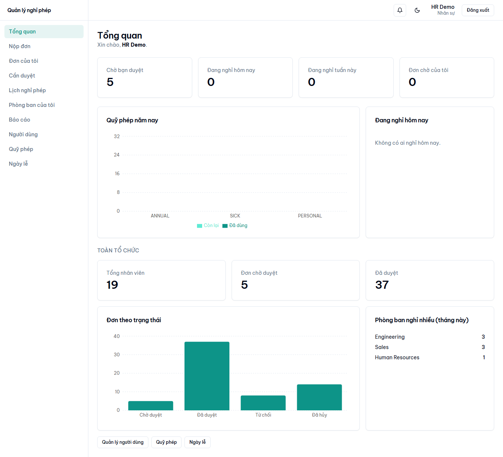
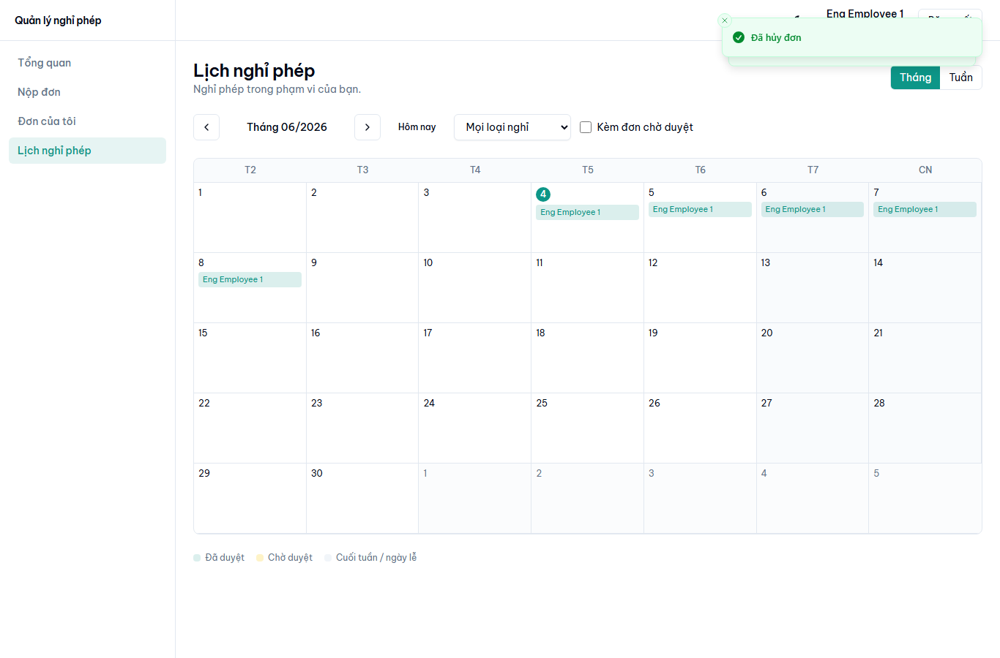
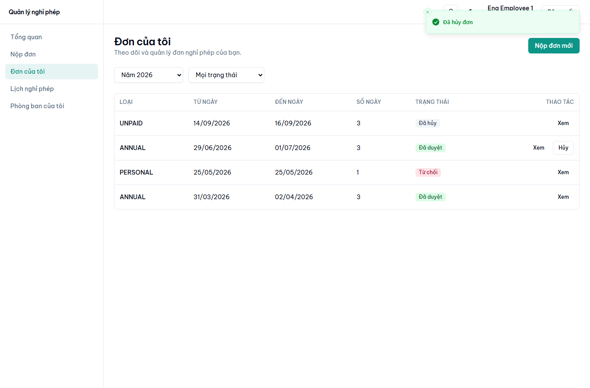
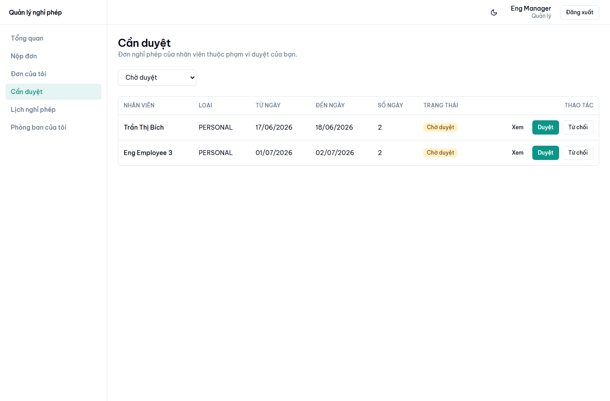
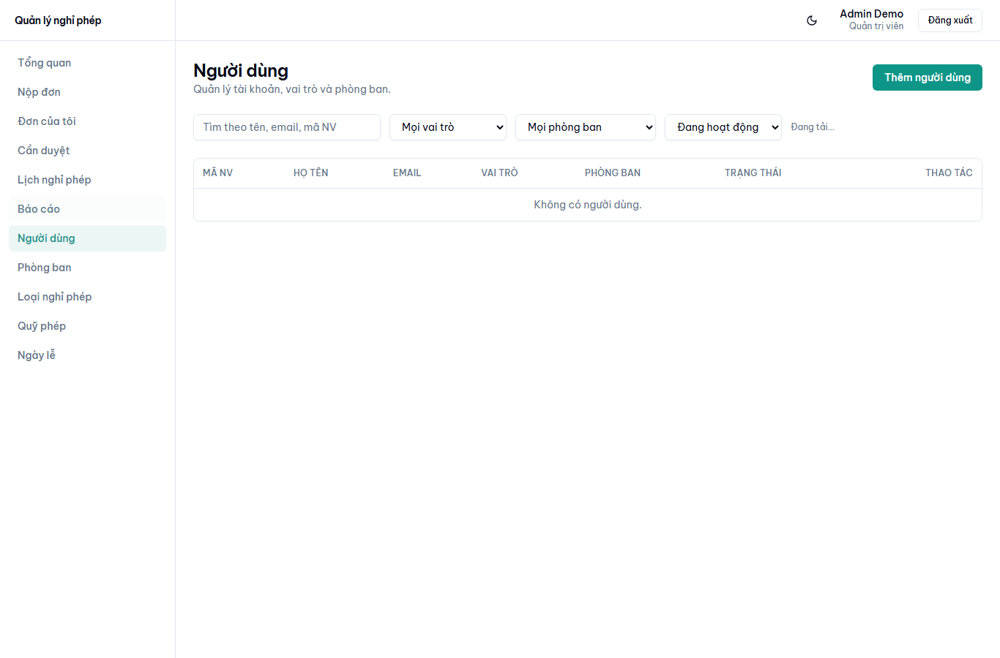
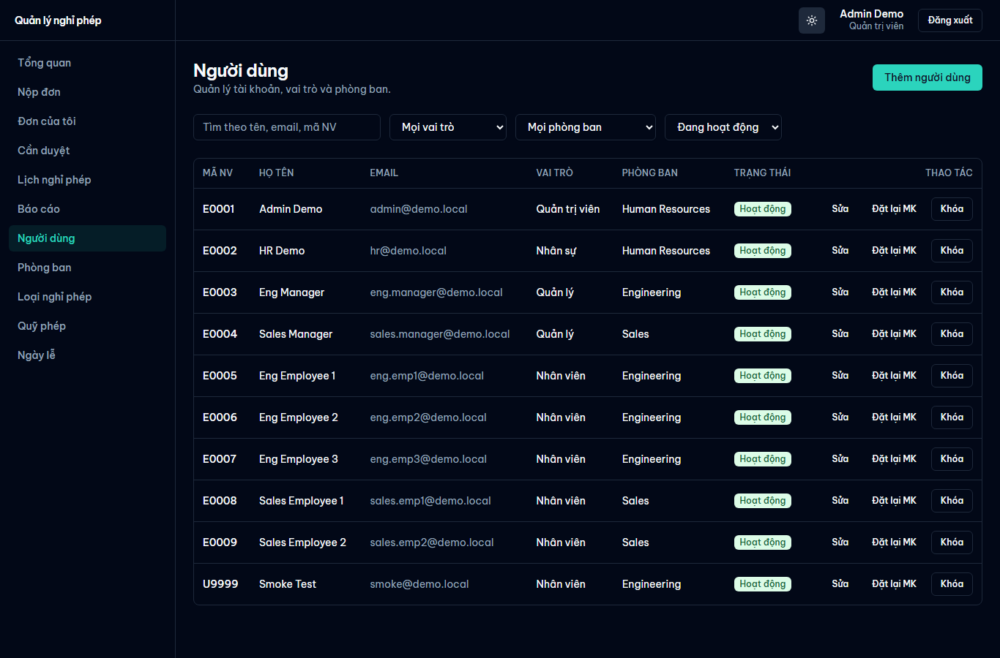
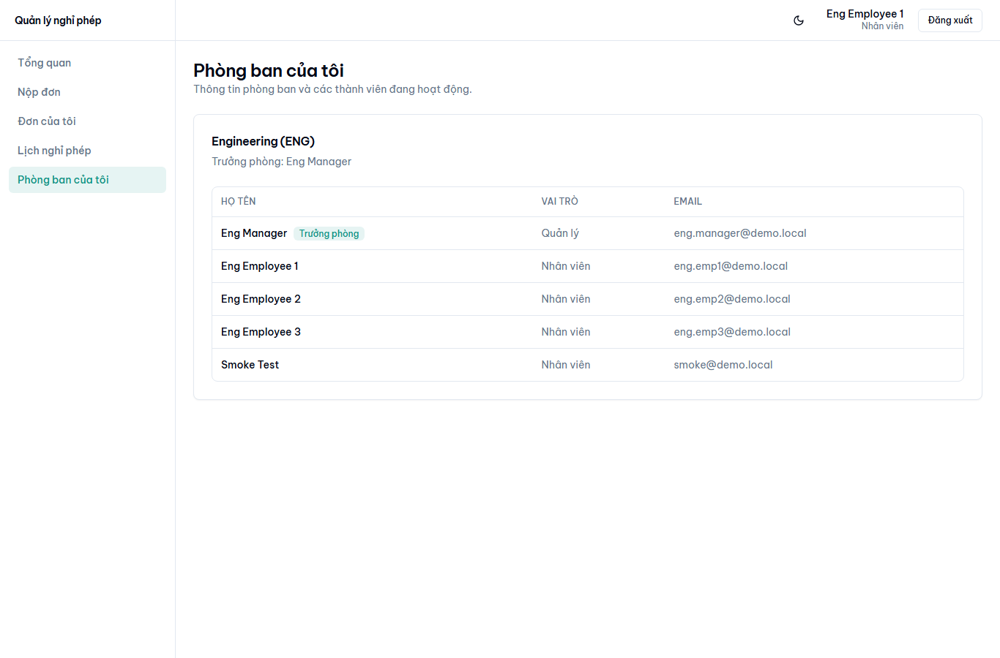
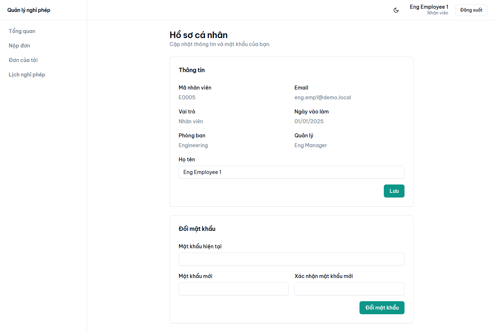

# Leave Management System

Hệ thống quản lý nghỉ phép — mô phỏng quy trình nghiệp vụ phê duyệt đơn nghỉ phép thực tế trong doanh nghiệp.

## Ảnh minh họa

| Tổng quan (HR) | Lịch nghỉ phép |
|---|---|
|  |  |

| Đơn của tôi | Cần duyệt |
|---|---|
|  |  |

| Quản lý người dùng | Quản lý người dùng (tối) |
|---|---|
|  |  |

| Phòng ban của tôi | Hồ sơ cá nhân |
|---|---|
|  |  |

## Tính năng chính

- Nhân viên tạo đơn nghỉ phép (loại nghỉ, thời gian, lý do, hỗ trợ nửa ngày).
- Trưởng nhóm/phòng phê duyệt hoặc từ chối đơn.
- HR theo dõi tổng thể và can thiệp khi cần.
- Quản lý số ngày phép còn lại của từng nhân viên theo loại nghỉ.
- Lịch tổng hợp nghỉ phép theo tháng/tuần, lọc theo phòng ban.
- Dashboard riêng cho từng vai trò.

## Công nghệ

**Backend:** Java 21 · Spring Boot 3.3 · Spring Security · Spring Data JPA · PostgreSQL 16 · Flyway · Gradle
**Frontend:** React 18 · TypeScript · Vite · Tailwind CSS · shadcn/ui · TanStack Query · React Hook Form · Zod
**Hạ tầng:** Docker · Docker Compose · GitHub Actions

Toàn bộ ứng dụng (backend, frontend, database) được container hóa từ đầu — chỉ cần Docker để chạy.

## Yêu cầu môi trường

- Docker Desktop (Docker Engine 24+ và Docker Compose v2+)
- Git
- IDE: IntelliJ IDEA Community (khuyến nghị) hoặc VS Code
- *(Tùy chọn)* Java 21 + Node 22 trên máy host để IDE autocomplete

## Khởi chạy

```bash
# Clone repo
git clone <repo-url>
cd leave-management-system

# Tạo file .env từ mẫu
cp .env.example .env

# Khởi động toàn bộ stack
docker compose up

# Truy cập:
# - Frontend:    http://localhost:5173
# - Backend API: http://localhost:8080
# - Swagger UI:  http://localhost:8080/swagger-ui.html
# - Postgres:    localhost:5432
```

Chi tiết xem [`docs/DEVELOPMENT.md`](docs/DEVELOPMENT.md).

Đăng nhập demo (profile `dev`): `admin@demo.local / Admin@12345` (ADMIN), `eng.manager@demo.local / User@12345` (quản lý), `eng.emp1@demo.local / User@12345` (nhân viên).

DB dev được **seed sẵn dữ liệu demo phong phú** (19 nhân viên 3 phòng ban, quỹ phép, ~60 đơn nghỉ trải 5 tháng với đủ trạng thái — ngày tính tương đối theo hôm nay nên không bao giờ cũ). Muốn seed lại từ đầu: `docker compose down -v && docker compose up`.

## Màn hình frontend

- **Tổng quan** — stat cards (chờ duyệt, đang nghỉ hôm nay/tuần này, đơn chờ) + biểu đồ quỹ phép; HR/ADMIN có khu toàn tổ chức.
- **Nộp đơn** / **Đơn của tôi** — tạo, sửa đơn PENDING, theo dõi, hủy đơn; xem lịch sử xử lý.
- **Cần duyệt** (quản lý/HR/ADMIN) — inbox duyệt/từ chối.
- **Lịch nghỉ phép** — lưới tháng/tuần theo phạm vi, lọc phòng ban/loại nghỉ/theo người.
- **Phòng ban của tôi** — danh bạ thành viên cùng phòng (mọi vai trò).
- **Hồ sơ cá nhân** — thông tin (phòng ban, quản lý), đổi mật khẩu.
- **Báo cáo** (HR/ADMIN) — xuất CSV đơn nghỉ + quỹ phép + tổng hợp theo tháng/quý.
- **Quản trị** (HR/ADMIN/ADMIN) — người dùng, phòng ban, loại nghỉ, quỹ phép, ngày lễ.

## Triển khai production

```bash
cp .env.prod.example .env   # điền JWT_SECRET, POSTGRES_PASSWORD, ...
docker compose -f docker-compose.prod.yml up -d --build
```

Chi tiết xem [`docs/DEPLOYMENT.md`](docs/DEPLOYMENT.md).

## Tài liệu

- [Yêu cầu nghiệp vụ](docs/REQUIREMENTS.md)
- [Kiến trúc hệ thống](docs/ARCHITECTURE.md)
- [Thiết kế database](docs/DATABASE.md)
- [Hướng dẫn phát triển](docs/DEVELOPMENT.md)
- [Hướng dẫn triển khai](docs/DEPLOYMENT.md)
- [Quy ước thiết kế UI](docs/UI-GUIDELINES.md)

## Trạng thái

✅ **MVP hoàn chỉnh** (auth, CRUD, đơn nghỉ + duyệt, lịch tháng/tuần, dashboard theo vai trò, báo cáo CSV, console quản trị, cấu hình production) — đáp ứng toàn bộ `docs/REQUIREMENTS.md`. UI tiếng Việt duy nhất (không làm i18n — xem REQUIREMENTS §14). Backend phủ test đầy đủ; FE build/lint sạch; có E2E Playwright (`e2e/`).

## Giấy phép

[MIT](LICENSE)
